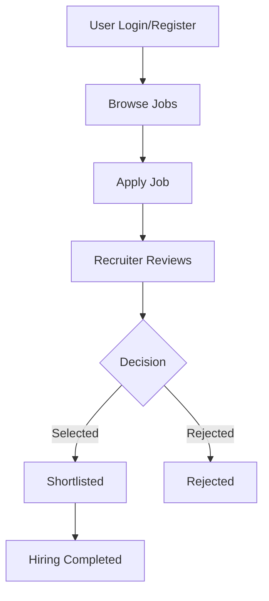
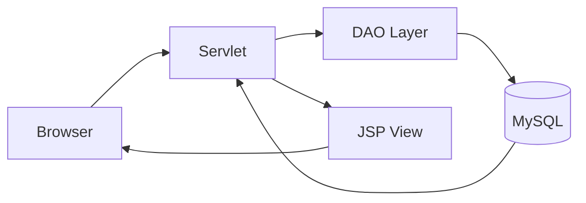

<div align="center">


<br/>


<br/>


<br/><br/>


<br/><br/>

### A full-stack Job Portal system built with Java, JSP, Servlets, MySQL, and Apache Tomcat.

</div>

---

# JobPortal

**JobPortal** is a full-stack web application designed to connect **job seekers** and **recruiters** through a centralized hiring platform.

It provides a structured workflow where recruiters can post jobs, candidates can apply, and the system manages the entire hiring lifecycle.

---

## Overview

This is not just a CRUD project. It is a **real-world recruitment workflow system** including:

```text
User authentication system
Job posting system
Job application workflow
Recruiter dashboard
Candidate management
Database integration
Session-based authentication
Tomcat deployment
```

---

## Project Objective

```text
Build a real-world job portal system
Implement full-stack development
Demonstrate database integration
Show deployment-ready application
Create portfolio-level project
```

---

## Core Workflow

```text
User registers/login
        ↓
Recruiter posts job
        ↓
Job seekers search jobs
        ↓
Apply for job
        ↓
Recruiter reviews applicants
        ↓
Shortlist / Reject candidates
        ↓
Hiring process completed
```

---

## System Flow Diagram



---

## Key Features

### Job Seeker Features

```text
User Registration
Login System
Search Jobs
Apply for Jobs
View Job Details
```

### Recruiter Features

```text
Post Jobs
Manage Job Listings
View Applicants
Shortlist Candidates
Reject Applications
```

### System Features

```text
Secure Authentication
Session Management
Database Integration
MVC Architecture
Tomcat Deployment
```

---

## User Roles

### Job Seeker

* Search jobs
* Apply jobs
* Manage profile

### Recruiter

* Post jobs
* Manage candidates
* Review applications

---

## Technology Stack

| Layer        | Technology    |
| ------------ | ------------- |
| Language     | Java          |
| Backend      | Servlet / JSP |
| Frontend     | HTML, CSS, JS |
|              | , JSTL        |
| Database     | MySQL         |
| Server       | Apache Tomcat |
| Architecture | MVC           |

---

## Architecture

```text
Browser → JSP → Servlet → DAO → MySQL → Response
```



---

## Project Structure

```text
JobPortalWeb/
│── src/
│── WebContent/
│── database/
│── pom.xml
```

---

## Database Setup

```sql
CREATE DATABASE portal;
```

Update DB config:

```text
username=root
password=
```

---

## Local Setup Guide

### Clone Repository

```bash
git clone https://github.com/pathrabedevesh/JobPortalWeb.git
```

### Run Project

```text
Import into Eclipse
Configure Tomcat
Run project
```

---

## Deployment

```text
AWS EC2 instance
Apache Tomcat
Port 8080 enabled
```

## 🚀 Live URL:

```text


http://54.160.157.31:8080/JobPortal/

```

---

## Testing Flow

```text
Register user
Login
Search job
Apply job
Login recruiter
Post job
Review applicants
```

---

## Current Status

| Feature              | Status   |
| -------------------- | -------- |
| Login System         | Complete |
| Job Posting          | Complete |
| Job Search           | Complete |
| Apply System         | Complete |
| Database Integration | Complete |

---

## Future Enhancements

```text
AI Job Recommendation
Email Notifications
Mobile Responsive UI
Admin Dashboard
```

---

## Learning Outcomes

```text
Java Web Development
Servlet & JSP
MySQL Integration
MVC Architecture
Deployment on AWS
```

---

## Author

```text
Devesh Pathrabe
```

GitHub:

```text
https://github.com/pathrabedevesh
```

---

## License

```text
This project is for academic and portfolio use.
```

---

<div align="center">


<br/><br/>


<br/><br/>


</div>
